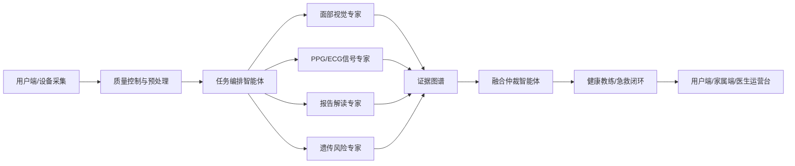

# Vitalife

Vitalife 是一个“多模态心血管与抗衰健康管理 Agent”平台原型。工程把面部视觉表型、掌腹 PPG/ECG、体检报告 OCR、基因 PRS、用户症状和照护信息组织成可解释证据，再由多智能体管线完成质量控制、专家分析、证据图谱、融合仲裁、健康干预和急性风险闭环。

## 已实现平台

- 用户健康总览：风险分、血管年龄偏离、实时体征、7 日趋势、闭环任务。
- 多模态采集台：面部 ROI、PPG 复测、报告/基因上传状态、端侧隐私控制。
- 智能体分析中心：任务编排流程、质量控制向量、专家证据表、RiskPrompt 输出。
- 报告中心：周期健康报告、医生复核、家属同步、归档流程。
- 医生/运营台：人群分层队列、复核队列、医生备注。
- 急救联动台：急性事件演练、端侧提醒、家属通知、审计日志流程。
- 系统设置：授权、隐私、接口、上线检查清单。

## 工程结构

- `apps/web`：React + Vite 前端平台。
- `apps/api`：Express API 与可替换的多智能体分析管线。
- `.github/workflows/ci.yml`：GitHub Actions 类型检查、构建和冒烟测试。
- `docker-compose.yml`：API + Web 容器化演示。

## 本地运行

```bash
npm install
npm run dev
```

打开 `http://localhost:5173`。API 默认运行在 `http://localhost:8787`。

## 常用命令

```bash
npm run check
npm run build
npm test
```

## API

- `GET /health`
- `GET /api/platform/overview`
- `GET /api/patients`
- `GET /api/patients/:id`
- `GET /api/patients/:id/timeline`
- `POST /api/analysis/run`
- `POST /api/emergency/simulate`

## 架构



## 医疗安全说明

当前仓库是工程原型，不构成医学诊断，不能替代临床评估、急救服务或经监管批准的医疗器械软件。进入生产前需要完成数据合规、风险管理、临床验证、模型验证和监管审查。
